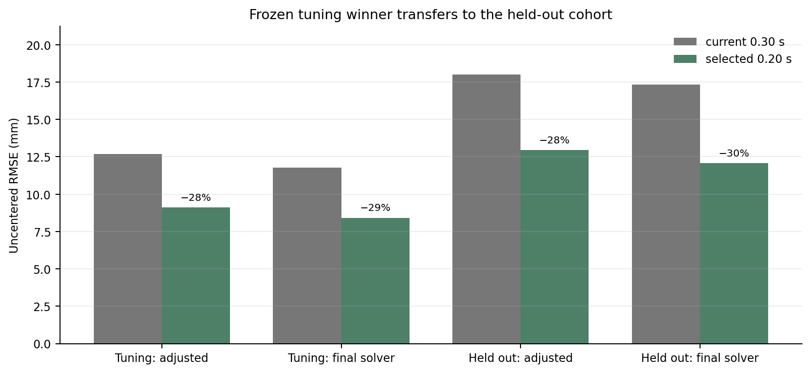
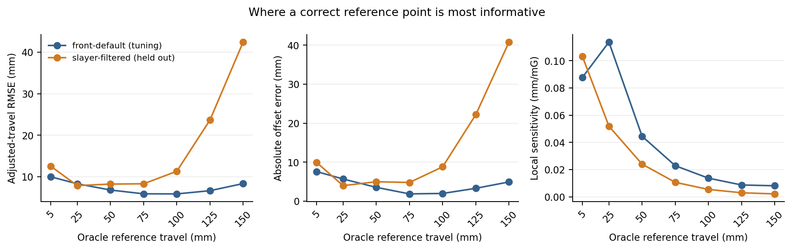
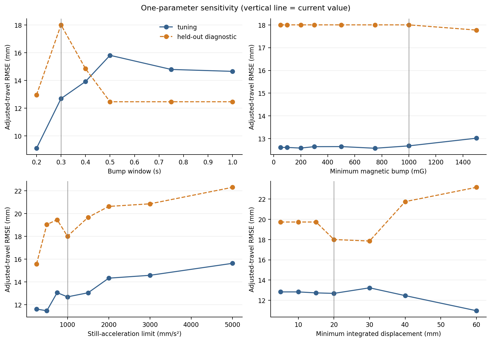
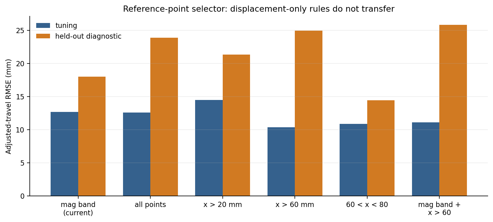

# Magnetic travel reference-point experiment

> **Follow-up cache note (2026-09-14):** the available downstream caches were
> generated by the older pre-nuisance reference placement. This report removes
> their historical scalar offset and is valid as an offset-only parameter
> comparison, but it is not an exact rerun of the newly reordered pipeline.
> A subsequent common-upstream reconstruction reran both nuisance and fusion
> stages, confirmed the 0.20 s recommendation, and found that the corrected-mag,
> post-correction placement transfers better to Slayer. See
> [`ref-point-placement-v1/report.md`](../ref-point-placement-v1/report.md).

## Executive result

The most defensible immediate change is to shorten `bump_len_s` from **0.30 s to 0.20 s**, leaving the magnetic-band selector and the other generic defaults unchanged.

This was the winner selected using only the 38-log `front-default` tuning cohort. On the seven completely held-out `slayer-filtered` chunks, it reduced adjusted-travel RMSE from **18.00 mm to 12.95 mm (28%)** versus the generic automatic algorithm. After replaying the final `TravelSolver`, RMSE fell from **17.35 mm to 12.07 mm (30%)**. It improved four held-out logs, tied three logs where both methods fell back, and regressed none.[^finalists] [^solver]

The deployed Slayer configuration is a stronger comparison because it uses hand-set `fixed_reference` values rather than automatic reference discovery. The 0.20 s automatic estimator also beat those fixed references on this experiment: **12.95 vs 15.13 mm** before the final solver and **12.07 vs 14.46 mm** after it. When the two chunks from `log-0147` and `log-0152` are first averaged by parent so that each of the five parents has equal weight, the corresponding final-solver result is **12.02 vs 13.05 mm**.[^parents]

I would not yet change the displacement threshold, stationary threshold, fallback percentile, or magnetic selector. Several of those choices look good on `front-default` but reverse on Slayer. Lowering `bump_mag_min` does recover more candidate chunks, but by itself it barely changes accuracy and does not recover any additional held-out logs.



## What the reference point can and cannot fix

The pipeline applies the estimated reference after magnetic nuisance correction and before the final travel solver. For a magnetic model `f`, the applied correction is one constant:

```text
offset = reference_travel - f(reference_magnitude)
adjusted_travel(t) = nuisance_corrected_travel(t) + offset
```

That is faithful to `ApplyMagTravelRefPoint`: it does not reshape the mag-to-travel curve; it translates the whole prediction vertically.[^fusion] The experiment likewise removes any historical scalar offset embedded in each cached nuisance-corrected trace, estimates one candidate offset, applies it, and then optionally replays `TravelSolver`.[^experiment]

Consequently, a better reference primarily removes mean bias. It cannot repair curve-shape error, hysteresis, bad nuisance correction, or time-varying error. Algebraically, for a fixed trace,

```text
uncentered RMSE² = centered shape-error RMSE² + mean error²
```

This is visible in the final replay: changing only the reference reduces held-out mean error from **+8.41 mm to +3.14 mm**, while centered RMSE changes only from **5.67 mm to 5.53 mm**.[^solver]

### Is a reference at 5, 50, or 150 mm best?

The nominal travel value is not intrinsically important: any exact `(travel, magnitude)` pair on a perfect model produces the same offset. In practice, location matters because the model is imperfect, the curve has different local sensitivity, and some travel regions are poorly represented.

I ran an oracle diagnostic that uses ground truth only to choose the magnetic sample within ±2.5 mm of target travels. This isolates *where* a trustworthy anchor would be most informative; it is not an implementable estimator.

| Oracle anchor | front-default RMSE | Slayer RMSE | Interpretation |
|---:|---:|---:|---|
| 5 mm | 9.97 mm | 12.52 mm | Too close to zero; high mm-per-mG sensitivity amplifies magnetic error |
| 25 mm | 8.28 mm | **7.85 mm** | Best on Slayer |
| 50 mm | 6.78 mm | 8.21 mm | Strong on both cohorts |
| 75 mm | 5.87 mm | 8.29 mm | Strong on both cohorts |
| 100 mm | **5.85 mm** | 11.30 mm | Good on tuning, weaker and sparse on Slayer |
| 125 mm | 6.62 mm | 23.66 mm | Poor Slayer coverage; only four logs contribute |
| 150 mm | 8.34 mm | 42.43 mm | Not interpretable on Slayer; one sample in one log |

The robust overlap is approximately **50–75 mm**. A 5 mm anchor is noisy because the mean local sensitivity is roughly 0.088–0.103 mm/mG there. At 50 mm it drops to 0.024–0.044 mm/mG. Very high anchors have low magnetic sensitivity but lose data coverage and accumulate model mismatch.[^anchors]



This does not mean the automatic detector should simply force its integrated-acceleration estimate to 50–75 mm. The integration estimate itself is biased, especially as the window grows. It means that a future estimator should preferentially seek a *well-supported, bounded mid-travel anchor* and explicitly model its uncertainty.

## Experiment design

### Split and leakage controls

- **Tuning:** all 38 usable `front-default` logs. Metrics are averaged within the four front subcohorts and then averaged across subcohorts, so the largest subgroup cannot dominate selection.
- **Held out:** all seven `slayer-filtered` chunks, originating from five parent logs. No Slayer metric was used to choose the primary winner or the interaction grid.
- All derived chunks from a parent remain in validation; no sibling of a held-out chunk appears in tuning.
- Ground-truth travel is used for scoring, the oracle-location diagnostic, and rejection analysis only. Candidate estimators never use it.
- Slayer registry `fixed_reference` values are ignored by automatic candidates and evaluated separately as the deployed comparison. The registry’s `min_ref_points = 20` and 40 mm maximum offset delta were also tested as a no-fixed-reference safety configuration.[^registry]

The exact log lists, git revision, and run settings are recorded in the manifest.[^manifest]

### Search

The experiment evaluates:

- 121 one-at-a-time configurations covering baseline percentile/window, magnetic bump, stationary acceleration, integrated displacement, bump/still windows, stride, skip count, magnetic reference range, minimum reference magnitude, minimum point support, fallback percentile/motion quantile, negative-travel guard, offset cap, and selector variants;
- 128 interactions assembled from the two best tuning levels of the five main detector dimensions and the four best tuning selectors;
- seven predeclared recovery/safety combinations;
- eight tuning-selected finalists, plus the generic current method, all-points selector, and `x > 20 mm` selector on the held-out cohort;
- final-solver replay for the frozen primary winner, generic automatic method, and registry fixed references.

The primary selection metric is cohort-balanced uncentered adjusted-travel RMSE. Low-travel (0–30 mm) RMSE, offset error, fallback rate, point support, and centered error are retained as diagnostics.[^selection]

After freezing the winner, I also evaluated all one-at-a-time settings on Slayer to identify non-transfer and unsafe directions. Those values are explicitly labeled **held-out diagnostic** and are not selection evidence.[^diagnostic]

### Fidelity audit

The replay follows the current pipeline ordering and signal choices: nuisance-corrected magnetic magnitude plus projected acceleration feed the reference finder; its scalar offset is applied to nuisance-corrected magnetic travel; that adjusted signal then feeds the final travel solver.[^pipeline] Chunk orientation, timing, double integration, skip behavior, magnetic-band calculation, medians, motion-mask fallback, and the default thresholds mirror the production implementations.[^fusion]

There are two deliberate implementation differences. The sweep rejects non-finite candidate chunks explicitly, and if baseline estimation finds no stationary window it uses the configured magnetic percentile instead of allowing an empty median to become `NaN`. Neither exception path affected the reported comparison materially, but both make batch evaluation well-defined.

The sweep is standalone because `GetMagBaseline` and `GetMagTravelRefPoint` are not dataclasses. Their scalar class attributes therefore are not accepted as constructor keywords—the cause of the notebook’s `fallback_percentile` error—and most detector scalars are read directly rather than through `Step.param`. The experiment measures proposed code/default changes; it does not imply those values can currently be supplied as registry overrides without first making the production classes configurable.[^fusion]

## Parameter findings



### `bump_len_s`: change 0.30 s → 0.20 s

This is the clearest result. On tuning, 0.20 s reduces adjusted RMSE from **12.68 to 9.10 mm** and absolute offset error from **11.22 to 6.54 mm**. On held-out Slayer it reduces adjusted RMSE from **18.00 to 12.95 mm** and reference-position error among supported estimates from **+14.75 to −1.11 mm**.[^finalists]

Longer windows produce more chunks but worse references. At 0.50 s and above, every Slayer result is rejected by the fallback guard; their apparently decent 12.46 mm diagnostic score is therefore the zero-reference fallback, not successful calibration.[^diagnostic] The likely mechanism is double-integration drift plus violation of the zero-initial-velocity assumption as the window grows.

### `bump_mag_min`: lowering it helps coverage, not accuracy by itself

The user hypothesis is directionally right about sensitivity. Reducing the threshold from 1000 to 200 mG raises tuning chunk count from **13.24 to 18.90 per log**, and 50 mG raises it to **20.25**. But tuning RMSE only moves from **12.685 to 12.587 mm**. On held-out Slayer, 50–750 mG produces more chunks but the same **18.001 mm** RMSE, the same 4/7 supported calibrations, and the same 4/7 fallback count.[^screen] [^diagnostic]

The rejection funnel explains why. `log-0147-filtered-c01` gets one magnetic-bump pass at 200 mG instead of zero, but `log-0152-filtered-c02` still gets zero. In other logs, the added low-amplitude events do not survive the downstream quality/fallback logic or do not improve the median reference.[^funnel]

Recommendation: **200 mG is a reasonable candidate for a future guarded detector**, but do not ship it alone expecting an accuracy gain. Couple it to confidence requirements such as multiple independent chunks, directional consistency, and an offset cap.

### Stationary acceleration: do not relax it globally

Tightening `still_a_max` to 500 mm/s² looks good on tuning (**11.47 mm**) but worsens held-out performance (**19.03 mm**). Relaxing it to 1500 mm/s² recovers a nominal reference in all seven Slayer logs, yet worsens RMSE to **19.66 mm**. At 5000 mm/s² tuning RMSE reaches **15.63 mm** and held-out reaches **22.29 mm**.[^screen] [^diagnostic]

This distinction matters: “found a reference” is not the same as “found a valid reference.” The recovery combination with `bump_mag_min=200` and `still_a_max=1500` finds all seven held-out references but scores **19.74 mm**, worse than current. Adding the 0.20 s window helps to **15.51 mm**; adding `min_ref_points=10` and the 40 mm offset cap reduces it further to **12.32 mm**, largely by refusing weak estimates.[^recovery]

### Integrated-displacement detection threshold: strong cohort dependence

`bump_dx_min=60 mm` is attractive on tuning (**10.97 mm**) but poor on held-out Slayer (**23.15 mm**). Values near the current 20–30 mm are more stable across cohorts. This gate answers whether a chunk contains enough apparent movement; it should not double as the point selector.[^screen] [^diagnostic]

### Baseline percentile: keep 5% (8% is effectively tied)

The current 5% result is **12.685 mm** on tuning. Eight percent is **12.684 mm**, a meaningless difference; 1% is worse at **13.335 mm** and is especially poor in the held-out diagnostic. There is no evidence for the notebook’s 1% setting. Keep 5% unless a larger baseline redesign is undertaken.[^screen]

### Other scalar parameters

- `still_len_s`, `stride_s`, and baseline still-window changes are small or inconsistent. Keep their current values.
- Reducing `skips` from 3 to 0–1 gives a modest tuning improvement, but it mainly admits overlapping near-duplicate chunks. Treat this as weighting, not independent evidence.
- Narrowing `ref_mag_range` can improve apparent RMSE by triggering fallback more often. That is a safety effect, not proof that the remaining reference is more accurate.
- Lower `min_ref_mag` looks better on tuning and worse on Slayer; it appears hardware/setup dependent.
- `fallback_percentile` is strongly non-transferable: low percentiles win on tuning, while a higher percentile wins in the Slayer diagnostic. Do not globally retune it from this split.
- `min_ref_points >= 5` and `max_offset_delta_mm <= 40` prevent the one-chunk failure on `log-0155`. They are useful guards, and the Slayer profile already contains the stricter 20-point/40-mm form, but the fallback itself must improve before aggressively rejecting more estimates.[^screen] [^diagnostic] [^registry]

## Should the mag-range selector be replaced with `x_points > bump_dx_min`?

**No.** The unbounded displacement-only rule does not transfer.

| Point selector | front-default RMSE | held-out diagnostic RMSE |
|---|---:|---:|
| Current magnetic band | 12.68 mm | 18.00 mm |
| All points | 12.59 mm | 23.90 mm |
| `x > 20 mm` | 14.47 mm | 21.33 mm |
| `x > 60 mm` | **10.38 mm** | 24.96 mm |
| `40 < x < 60 mm` | 12.89 mm | **12.92 mm** |
| `60 < x < 80 mm` | 10.88 mm | 14.45 mm |
| Magnetic band and `x > 60 mm` | 11.11 mm | 25.84 mm |

The current magnetic band is acting as cross-hardware protection. Removing it lets late-window integration drift and high-travel/model-mismatch points dominate. The apparent `40 < x < 60` Slayer result was discovered post hoc and is not a validated replacement. If displacement is incorporated, it should be **bounded on both sides**, combined with magnetic plausibility, and selected on a new training split.[^screen] [^diagnostic]



## Held-out log behavior

Final-solver RMSE by Slayer chunk:

| Log | Generic automatic | Selected 0.20 s | Registry fixed ref |
|---|---:|---:|---:|
| `log-0145-filtered-c01` | 7.44 | **4.53** | 5.24 |
| `log-0147-filtered-c01` | 14.72 | 14.72 | **14.61** |
| `log-0147-filtered-c02` | **18.93** | **18.93** | 42.15 |
| `log-0151-filtered-c01` | 7.18 | **6.01** | 9.26 |
| `log-0152-filtered-c01` | 6.00 | **4.85** | 5.26 |
| `log-0152-filtered-c02` | 10.26 | 10.26 | **9.99** |
| `log-0155-filtered-c01` | 56.93 | 25.20 | **14.74** |

The primary win is real but uneven. The shorter window dramatically reduces the bad one-chunk estimate on `log-0155`, yet the registry fixed reference remains best there. On the three fallback ties, improving the fallback or finding genuinely informative low-amplitude events is the next opportunity. The shared fixed reference for both `log-0147` chunks performs very differently—14.61 vs 42.15 mm—which is evidence that a single parent-level pair can be brittle across operating segments.[^solverlog] [^registry]

## Recommended next implementation

1. **Ship or A/B `bump_len_s=0.20` first.** It is the only simple change that was selected without validation leakage and transferred cleanly through the final solver.
2. **Keep the magnetic-band selector for now.** Do not replace it with unbounded `x > bump_dx_min`.
3. **Retain a 40 mm offset-delta guard and require more than one effective chunk.** Count independent events, not overlapping windows; the current `min_ref_points` counts samples and can overstate support.
4. **Prototype a confidence-scored recovery path:** try `bump_mag_min≈200 mG`, but accept it only when forward/reverse estimates agree, chunk starts are near zero travel, integrated velocity is physically plausible, and multiple separated events produce a tight offset distribution.
5. **Target a bounded mid-travel reference (roughly 50–75 mm) when confidence permits.** Estimate an offset per chunk first, then robustly aggregate offsets. This is more direct than independently taking median `x` and median magnitude and pairing them.
6. **Improve fallback next.** Three Slayer chunks still fall back with the winning detector. The percentile fallback is setup dependent; a model based on stationary magnetic distributions, parent/session priors, or uncertainty-weighted solver anchoring is more promising than one global percentile.

The next validation should use new parent logs, not another split of these same five Slayer parents. Parent-level generalization is the real deployment question.

## Reproduction

Run the full search and solver replay from the repository root:

```bash
MPLBACKEND=Agg MPLCONFIGDIR=/tmp/mag-ref-sweep PYTHONPATH=backend \
  ./venv/bin/python tools/front/mag_offset_calibration/sweep_ref_point_parameters.py \
  --output-dir experiments/fusion/ref-point-parameter-sweep-v1 \
  --replay-solver

MPLBACKEND=Agg MPLCONFIGDIR=/tmp/mag-ref-sweep \
  ./venv/bin/python tools/front/mag_offset_calibration/plot_ref_point_parameter_sweep.py \
  experiments/fusion/ref-point-parameter-sweep-v1
```

`--solver-only` reuses an existing completed sweep and fills in any missing final-solver comparisons.

## Limitations

- The held-out cohort has only five independent parents; seven derived chunks are not seven independent hardware sessions.
- Cached nuisance-corrected travel is reused rather than rerunning every upstream signal-processing step. Historical cached scalar offsets are explicitly removed before applying each candidate.
- Oracle anchor results measure the value of an accurate reference at a location; they do not prove the acceleration-integral detector can find that location accurately.
- The one-at-a-time Slayer sweep is post hoc diagnostic. Only the 0.20 s primary winner and tuning-selected interaction finalists retain a clean held-out interpretation.
- Log-level and subgroup-balanced means are useful for comparison but do not provide uncertainty intervals. More independent Slayer parents are needed before declaring a universal default.

## Sources

[^fusion]: Production reference detection and constant-offset application: [`backend/fusion.py`](../../../backend/fusion.py), especially `GetMagTravelRefPoint`, `get_abs_pos_ref`, and `ApplyMagTravelRefPoint`.
[^pipeline]: Current post-nuisance pipeline ordering: [`backend/pipeline.py`](../../../backend/pipeline.py).
[^experiment]: Experiment implementation and cache normalization: [`sweep_ref_point_parameters.py`](../../../tools/front/mag_offset_calibration/sweep_ref_point_parameters.py).
[^registry]: Slayer safety profile and per-log fixed references: [`logs/registry.toml`](../../../logs/registry.toml).
[^manifest]: Exact cohorts and revision: [`manifest.json`](manifest.json).
[^selection]: Frozen tuning selection and finalist configurations: [`selection.json`](selection.json).
[^anchors]: Oracle location data: [`oracle_anchor_travel_aggregate.csv`](oracle_anchor_travel_aggregate.csv) and [`oracle_anchor_travel_per_log.csv`](oracle_anchor_travel_per_log.csv).
[^screen]: Tuning one-at-a-time sweep: [`screen_aggregate.csv`](screen_aggregate.csv) and [`screen_per_log.csv`](screen_per_log.csv).
[^diagnostic]: Post-selection held-out diagnostic sweep: [`diagnostic_validation_screen_aggregate.csv`](diagnostic_validation_screen_aggregate.csv).
[^finalists]: Frozen finalist comparison: [`finalist_aggregate.csv`](finalist_aggregate.csv) and [`finalist_per_log.csv`](finalist_per_log.csv).
[^recovery]: Predeclared recovery combinations: [`recovery_aggregate.csv`](recovery_aggregate.csv).
[^funnel]: Sequential gate rejection counts: [`rejection_funnel.csv`](rejection_funnel.csv).
[^solver]: Final solver aggregates: [`solver_aggregate.csv`](solver_aggregate.csv).
[^solverlog]: Final solver per-log results: [`solver_per_log.csv`](solver_per_log.csv).
[^parents]: Parent-balanced validation comparison: [`validation_parent_aggregate.csv`](validation_parent_aggregate.csv).
