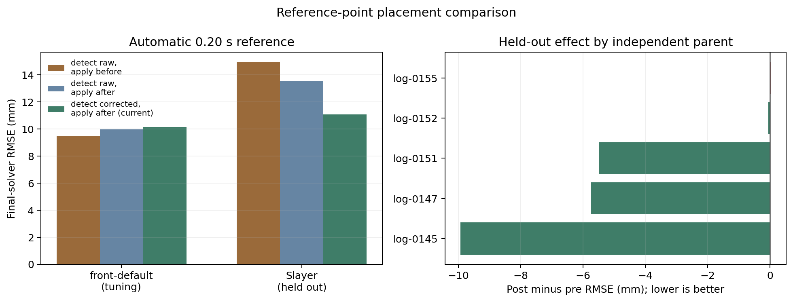

# Magnetic reference placement A/B

## Recommendation

**Keep the reference finder on nuisance-corrected magnitude and keep offset application after nuisance correction.** Moving both operations to the uncorrected signal improves the `front-default` tuning cohort, but that gain reverses decisively on held-out Slayer logs. The current placement is therefore the safer cross-hardware design.

Using the selected 0.20 s bump window, final-solver RMSE was:

| Placement | front-default tuning | Slayer held out | Slayer parent-balanced |
|---|---:|---:|---:|
| Detect uncorrected, apply before correction | **9.47 mm** | 14.94 mm | 14.75 mm |
| Detect uncorrected, apply after correction | 9.96 mm | 13.53 mm | 12.79 mm |
| Detect corrected, apply after correction (current) | 10.16 mm | **11.08 mm** | **10.51 mm** |

Relative to moving everything before correction, the current placement reduces held-out final RMSE by **25.9%** log-weighted and **28.8%** when each of the five independent Slayer parents receives equal weight.[^aggregate] [^parents]



## What was compared

All variants begin with identical upstream arrays and the same learned scalar mag-to-travel coefficients. For every placement the experiment reruns:

1. the first travel solver using the current zero out-of-bounds weight;
2. the low-rate magnetic nuisance fit;
3. full-rate nuisance-field removal and XYZ-path projection;
4. reference detection/application at the assigned location; and
5. the final travel solver using corrected magnitude and its recomputed baseline.

This matters because the historical `all.npz` caches were produced by the older pre-correction pipeline. Comparing their final arrays with newly ordered code would confound placement with cache generation. This experiment only reuses common inputs upstream of the intervention and ignores cached nuisance/final outputs.[^experiment] [^pipeline]

The 38 usable `front-default` logs remain the tuning set. All seven `slayer-filtered` chunks from five parents remain held out. Both 0.20 s and the historical 0.30 s bump windows were declared before validation. The registry fixed-reference policy is reported separately from automatic discovery.[^manifest]

## Does the conclusion depend on the 0.20 s window?

No. The historical 0.30 s control shows the same transfer reversal:

| Automatic reference | front-default tuning | Slayer held out | Slayer parent-balanced |
|---|---:|---:|---:|
| Uncorrected / before, 0.30 s | **10.64 mm** | 14.18 mm | 13.50 mm |
| Uncorrected / after, 0.30 s | 11.73 mm | 12.83 mm | 11.61 mm |
| Corrected / after, 0.30 s | 12.60 mm | **11.18 mm** | **10.46 mm** |

Thus post-correction wins on Slayer by **3.00 mm** with 0.30 s and **3.86 mm** with 0.20 s. The shorter window still wins clearly on tuning and is essentially tied with 0.30 s on validation after an exact full-chain replay.[^aggregate]

## Finder signal versus application position

The hybrid variant separates the two decisions:

- Keeping the raw detector but moving application from before to after correction changes held-out RMSE from **14.94 to 13.53 mm**.
- Keeping post application but changing the detector/fallback signal from raw to corrected changes it from **13.53 to 11.08 mm**.

Both choices help Slayer. Conversely, both slightly hurt the tuning aggregate. This is not a universal mathematical advantage; it is a cross-setup robustness result.

In 31 of 38 tuning logs, the raw- and corrected-signal post variants produce the same final RMSE. The large differences are concentrated in fallback cases. On validation:

- `log-0147-filtered-c02` has no usable reference under either detector. The raw p8 fallback applies **+2.45 mm**, while corrected magnitude applies **−9.59 mm**; final RMSE improves from **31.48 to 19.96 mm**.
- `log-0151-filtered-c01` rejects its reference. Raw fallback applies **+16.31 mm**, corrected fallback **−3.82 mm**; final RMSE improves from **13.89 to 8.25 mm**.
- `log-0145-filtered-c01` accepts a **+2.79 mm** post-correction reference and reaches **4.52 mm** RMSE. Before correction, the candidate fails the negative-travel guard and falls back to **+15.78 mm**, producing **14.45 mm** RMSE.[^perlog]

So the main benefit is not that nuisance correction makes every detected bump visibly better. It puts reference estimation—especially the zero-percentile fallback—in the same magnetic coordinate as the corrected observation being shifted.

## Does putting the offset inside nuisance fitting help?

Not reliably. The nuisance fit receives both the scalar offset and the first-pass travel, so pre-application is not exactly translation invariant: the offset changes the scalar-parameterized XYZ path, coverage boundaries, and nuisance solution.[^nuisance]

However, when the registry-fixed offset is identical and accepted, pure placement has almost no effect. Across six of seven held-out logs, moving the same fixed offset before versus after correction changes final RMSE by only **+0.015 mm on average**, with individual differences within approximately ±0.10 mm. The larger registry-policy aggregate difference—**15.78 mm before vs 14.80 mm after**—comes mainly from `log-0145`, where both placements reject the fixed candidate but use different raw/corrected fallback coordinates.[^perlog]

This argues against feeding offset calibration into the nuisance model merely for better nuisance estimation. Most of the practical value comes from calibrating and validating the offset in the corrected output coordinate.

## Cohort-level behavior

At 0.20 s, moving reference calibration before correction improves Harry, pod-v1, and pod-v2 tuning averages, while post-correction wins Jamaal and held-out Slayer:

| Cohort | Before RMSE | Current post RMSE | Better placement |
|---|---:|---:|---|
| Harry | 13.38 | 16.28 | Before |
| Jamaal | 11.03 | 9.19 | After |
| Stumpjumper pod-v1 | 9.06 | 9.28 | Approximately tied |
| Stumpjumper pod-v2 | 4.41 | 5.91 | Before |
| Slayer held out | 14.94 | 11.08 | After |

The tuning winner therefore does not transfer to a different bike/magnet configuration. Unless the pipeline becomes explicitly hardware-profile-specific, this is evidence against moving the global calibration point earlier.[^aggregate]

At the independent-parent level, post-correction improves four of five Slayer parents. The fifth (`log-0155`) changes by only **+0.018 mm**, effectively a tie.[^parents]

## Implementation guidance

1. Retain the current order: unadjusted scalar model → first fusion → nuisance correction → corrected baseline/reference → offset application → final fusion.
2. Retain corrected magnitude for both the reference finder and its fallback distribution.
3. Keep `bump_len_s=0.20` as the preferred automatic detector setting. Its advantage is large on tuning and it remains competitive on the exact held-out replay.
4. Treat fallback calibration as the next high-value target. Most placement gains come from corrected versus raw percentile fallback, and five of seven Slayer chunks still fall back with the guarded 0.20 s method.
5. If pre-correction calibration is ever enabled for specific hardware, make it a profile-level choice and validate on independent parents from that hardware family.

## Reproduction

```bash
MPLBACKEND=Agg MPLCONFIGDIR=/tmp/mag-placement PYTHONPATH=backend \
  ./venv/bin/python tools/front/mag_offset_calibration/compare_ref_point_placement.py \
  --output-dir experiments/fusion/ref-point-placement-v1 \
  --workers 8 --max-nfev 100

MPLBACKEND=Agg MPLCONFIGDIR=/tmp/mag-placement \
  ./venv/bin/python tools/front/mag_offset_calibration/plot_ref_point_placement.py \
  experiments/fusion/ref-point-placement-v1
```

All first- and final-solver runs converged in the completed experiment.[^aggregate]

## Limitations

- Slayer validation contains five independent parent logs. Parent-balanced results reduce duplicate-chunk weighting but remain a small external validation sample.
- Learned scalar coefficients are reused from cache. Their training inputs precede reference application, so this holds the curve fit constant and isolates placement.
- The final solver uses corrected magnitude for every variant. This deliberately isolates reference placement from the separate question of whether the final fusion gate should use raw magnitude.
- `front-default` and Slayer favor opposite placements. More independent bike/magnet setups are needed before claiming a universal result, but there is no held-out evidence supporting a global move earlier.

## Sources

[^experiment]: Full reconstruction and A/B implementation: [`compare_ref_point_placement.py`](../../../tools/front/mag_offset_calibration/compare_ref_point_placement.py).
[^pipeline]: Current pipeline ordering: [`backend/pipeline.py`](../../../backend/pipeline.py).
[^nuisance]: Nuisance-model use of scalar offset and initial travel: [`backend/mag_nuisance.py`](../../../backend/mag_nuisance.py) and [`backend/mag_nuisance_core.py`](../../../backend/mag_nuisance_core.py).
[^manifest]: Exact cohorts, revision, and solver settings: [`manifest.json`](manifest.json).
[^aggregate]: Cohort-balanced metrics: [`aggregate.csv`](aggregate.csv).
[^parents]: Equal-parent held-out metrics: [`validation_parent_aggregate.csv`](validation_parent_aggregate.csv).
[^perlog]: Per-log offsets, fallbacks, and errors: [`per_log.csv`](per_log.csv).
