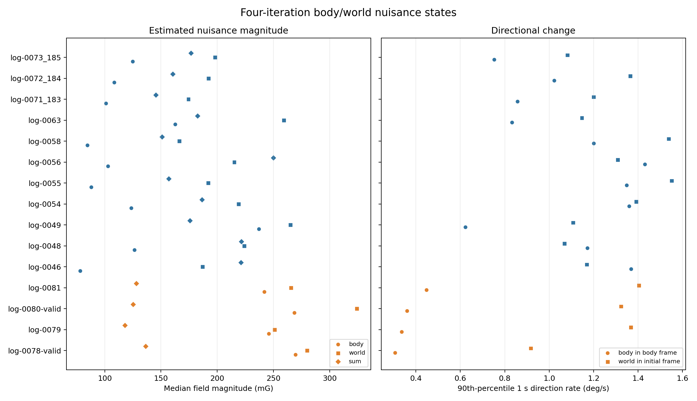

# Four-iteration nuisance-field dynamics

## Result

This report analyzes the final body/world states from the current favorite:
the four-iteration isotropic correction with the 1500 mG weak-field gate. The
field solve itself is unaffected by the later 75% travel-output blend.

Across the 15 logs, the median of each log's median field magnitude is 125 mG
for the body state, 219 mG for the world state, and 161 mG for their applied
sum. The individual states are often larger than their sum because they point
partly against one another: the median body/world angle is 131 degrees.

Measured over a one-second lag, the median of the per-log median direction
rates is:

- 0.39 deg/s for the body field in the body frame;
- 0.60 deg/s for the world field after gyro rotation into the initial/world
  frame; and
- 8.86 deg/s for the world field as seen in the rotating body frame.

The last value is much larger because it includes bike motion. The first two
are the useful estimates of how quickly the inferred physical states themselves
change direction.



## Setup summary

Each number below is the median across logs in that setup. `P90 rate` first
computes the 90th percentile within each log, then takes the median across logs.

| Setup | Logs | Body magnitude | World magnitude | Applied sum | Body direction median / P90 | World direction median / P90 | World seen in body, median / P90 |
| --- | ---: | ---: | ---: | ---: | ---: | ---: | ---: |
| All | 15 | 125 mG | 219 mG | 161 mG | 0.39 / 0.86 deg/s | 0.60 / 1.31 deg/s | 8.86 / 33.92 deg/s |
| Fox 36 | 11 | 109 mG | 198 mG | 177 mG | 0.40 / 1.17 deg/s | 0.58 / 1.20 deg/s | 10.48 / 37.03 deg/s |
| Boxxer | 4 | 257 mG | 273 mG | 127 mG | 0.18 / 0.35 deg/s | 0.62 / 1.35 deg/s | 6.99 / 29.96 deg/s |

Two patterns stand out:

1. The inferred world-field direction drift is remarkably similar across the
   setups: about 0.6 deg/s median and 1.2--1.35 deg/s at P90.
2. Boxxer has much larger individual body/world magnitudes but a smaller summed
   correction. Its body and world vectors are nearly opposed: the median
   per-log angle is 152 degrees versus 123 degrees on Fox.

That second pattern should not be interpreted as two independently measured
large physical fields. It is also a symptom of the body/world decomposition's
weak identifiability.

## Per-log summary

Magnitudes and direction rates are medians within each log. The P90 columns
show short periods of faster direction change.

| Log | Setup | Body | World | Sum | Body rate med / P90 | World rate med / P90 | World seen in body, med | Body/world angle |
| --- | --- | ---: | ---: | ---: | ---: | ---: | ---: | ---: |
| log-0056 | Fox 36 | 103.0 | 215.2 | 250.1 | 0.52 / 1.43 | 0.48 / 1.31 | 5.05 | 122.7 |
| log-0063 | Fox 36 | 162.8 | 259.2 | 182.6 | 0.25 / 0.83 | 0.67 / 1.15 | 3.35 | 141.6 |
| log-0046 | Fox 36 | 78.3 | 187.1 | 221.2 | 0.59 / 1.37 | 0.61 / 1.17 | 12.01 | 66.6 |
| log-0048 | Fox 36 | 126.5 | 224.0 | 221.6 | 0.40 / 1.17 | 0.49 / 1.07 | 3.55 | 112.6 |
| log-0049 | Fox 36 | 237.2 | 265.2 | 175.9 | 0.32 / 0.62 | 0.54 / 1.11 | 6.00 | 158.3 |
| log-0054 | Fox 36 | 123.7 | 219.1 | 186.6 | 0.42 / 1.36 | 0.65 / 1.39 | 10.62 | 125.2 |
| log-0055 | Fox 36 | 88.1 | 192.1 | 157.0 | 0.39 / 1.35 | 0.58 / 1.55 | 9.27 | 114.6 |
| log-0058 | Fox 36 | 84.7 | 166.2 | 151.1 | 0.48 / 1.20 | 0.72 / 1.54 | 18.74 | 122.0 |
| log-0071_183 | Fox 36 | 101.2 | 174.4 | 145.6 | 0.39 / 0.86 | 0.48 / 1.20 | 12.60 | 138.8 |
| log-0072_184 | Fox 36 | 108.6 | 192.2 | 160.6 | 0.35 / 1.02 | 0.61 / 1.37 | 10.48 | 131.2 |
| log-0073_185 | Fox 36 | 125.0 | 198.1 | 176.8 | 0.41 / 0.75 | 0.51 / 1.08 | 17.67 | 118.6 |
| log-0078-valid | Boxxer | 269.7 | 279.9 | 136.5 | 0.19 / 0.31 | 0.60 / 0.92 | 7.30 | 148.5 |
| log-0079 | Boxxer | 246.0 | 251.1 | 118.1 | 0.16 / 0.34 | 0.65 / 1.37 | 5.94 | 154.0 |
| log-0080-valid | Boxxer | 268.7 | 324.2 | 125.3 | 0.18 / 0.36 | 0.54 / 1.32 | 6.68 | 155.8 |
| log-0081 | Boxxer | 242.0 | 265.5 | 128.2 | 0.18 / 0.45 | 0.70 / 1.40 | 8.86 | 149.7 |

Magnitude columns are mG, rates are deg/s, and angles are degrees.

## Definitions and interpretation limits

- The solver outputs both vectors in the sensor/body frame. The world vector is
  rotated by integrated gyro into the initial frame before its intrinsic
  direction rate is calculated.
- Direction rate is the angle between vectors one second apart divided by the
  actual elapsed time. This is a finite-lag net rate, not a noisy 10 Hz
  derivative. Samples below 40 mG at either endpoint are excluded because
  direction becomes poorly defined near zero magnitude.
- The world-in-initial-frame rate contains real ambient change, gyro drift, and
  any residual model/travel error absorbed by the world random walk. It is not
  proof that the physical ambient field itself turns at 0.6 deg/s.
- The body and world vectors are a regularized decomposition of one observed
  residual. Their individual magnitudes and directions depend on the random-
  walk and initial-covariance weights. The sum is much more identifiable and is
  the quantity actually subtracted from the magnetometer.
- These are full-log RTS-smoothed trajectories, so they use future samples and
  are not causal production-state dynamics.

## Files and reproduction

- `per_log_summary.csv`: full P10/median/P90 statistics.
- `cohort_summary.csv`: median per-log statistics by setup.
- `timeseries_1hz.csv`: downsampled time series for plotting.
- `metadata.json`: weights, arguments, and frame definitions.

```bash
MPLBACKEND=Agg MPLCONFIGDIR=/tmp/sus-mpl-cache \
  venv/bin/python tools/front/mag_nuisance/analyze_field_dynamics.py
```
