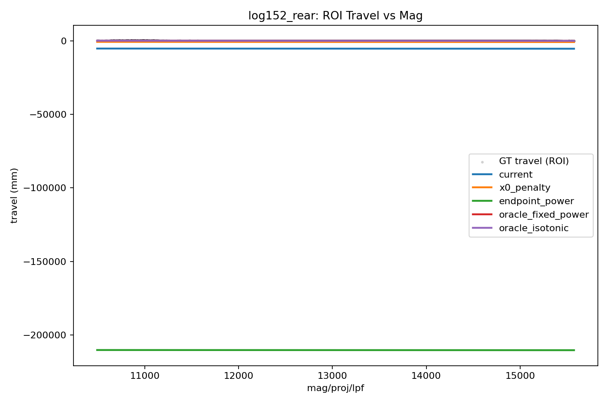
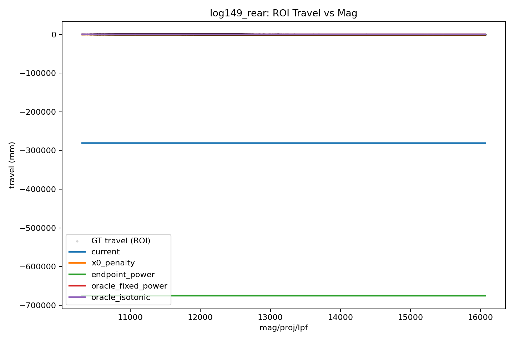

# Rear Chunk Curve Method Analysis

Logs used:

- `log149_rear`
- `log150_rear`
- `log151_rear`
- `log152_rear`
- `log153_rear`

## Main Findings

- The current chunk-trained power-law still wins among the chunk-only methods I tried. Its mean masked aligned RMSE is `5.661 mm`.
- The `x0`-penalty variant helps only modestly on average: `5.329 mm` mean masked aligned RMSE.
- Endpoint-only power-law fitting is the only chunk-only alternative that sometimes helps, but it is inconsistent and slightly worse overall at `5.959 mm`.
- The more RANSAC-like aggregation ideas did not recover curvature. Binned secant aggregation averaged `7.341 mm`, and the monotone knot fit averaged `7.054 mm`.
- The GT-only ceilings remain much better: fixed-power scan oracle `4.352 mm`, isotonic oracle `4.284 mm`.
- The curvature-identifying signal is weak at the chunk level. Across logs, the current learned model and the GT-curved oracle explain nearly the same number of chunks under practical inlier thresholds.

## Interpretation

- The chunks clearly contain enough first-order information to beat a constant-travel baseline, but not enough clean second-order information to reliably identify curvature.
- Penalizing `x0` toward zero changes which branch the optimizer lands on, but it does not supply the missing curvature evidence. Once the weight is nonzero, all those fits converge to essentially the same near-zero-`x0` branch.
- Endpoint constraints are cleaner than full interior chunk traces, which is why endpoint-only power-law fitting sometimes helps, but even that does not reliably recover the GT curve.
- A plain RANSAC strategy is unlikely to solve this by itself because the true curved model does not win a dramatically larger inlier set than the line-like model.

## Mean Method Metrics

| Method | Mean masked aligned RMSE (mm) | Mean corr | Mean slope ratio q90/q10 |
|---|---:|---:|---:|
| `current` | 5.661 | 0.9718 | 1.003 |
| `x0_penalty` | 5.329 | 0.9751 | 1.104 |
| `endpoint_power` | 5.959 | 0.9717 | 1.003 |
| `endpoint_power_bounded` | 8.155 | 0.9469 | 5.269 |
| `binned_secant` | 7.341 | 0.9498 | 18689400.288 |
| `monotone_knots` | 7.054 | 0.9530 | 6188752.817 |
| `oracle_fixed_power_scan` | 4.352 | 0.9816 | 1.538 |
| `oracle_isotonic` | 4.284 | 0.9826 | 0.004 |

Average chunk-support counts for current learned vs GT curved oracle:

| Chunk RMSE threshold (mm) | Current learned | GT curved oracle |
|---|---:|---:|
| `2` | 28.6 | 29.4 |
| `3` | 76.6 | 76.8 |
| `4` | 136.2 | 137.2 |
| `5` | 195.6 | 195.2 |
| `6` | 263.0 | 261.2 |
| `8` | 393.4 | 396.8 |
| `10` | 506.2 | 506.2 |

## Per-Log Summary

| Log | Current | x0 penalty | Endpoint power | Binned secant | Monotone knots | Oracle fixed-power | Oracle isotonic |
|---|---:|---:|---:|---:|---:|---:|---:|
| `log149_rear` | 6.829 | 6.115 | 5.762 | 8.305 | 6.872 | 4.641 | 4.557 |
| `log150_rear` | 5.126 | 4.886 | 5.680 | 6.889 | 5.840 | 4.429 | 4.401 |
| `log151_rear` | 5.777 | 5.130 | 4.925 | 7.510 | 7.301 | 3.860 | 3.766 |
| `log152_rear` | 4.910 | 4.760 | 5.163 | 7.146 | 6.982 | 4.419 | 4.370 |
| `log153_rear` | 5.660 | 5.755 | 8.263 | 6.854 | 8.276 | 4.410 | 4.327 |

Representative best current-log plot: `log152_rear`

Representative worst current-log plot: `log149_rear`

