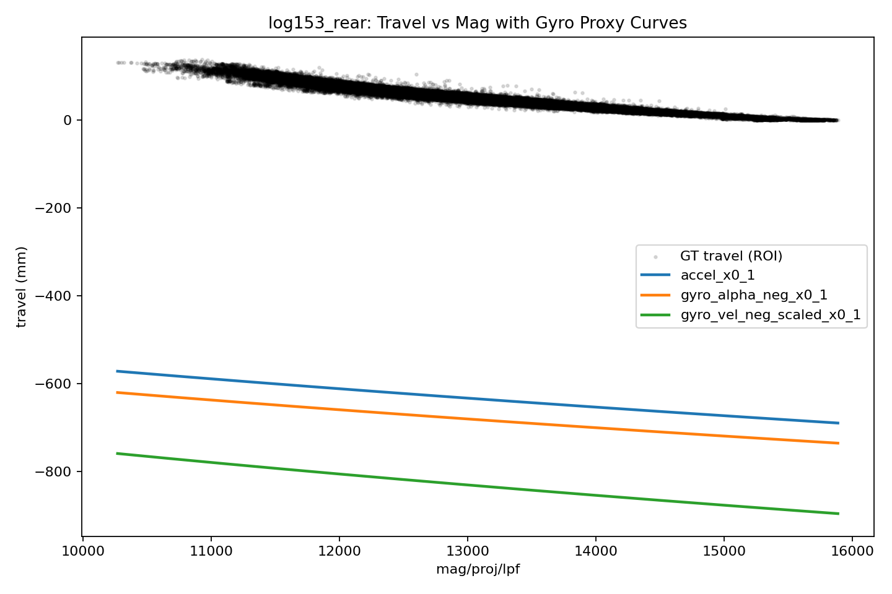

# Rear Gyro Proxy Method Analysis

Logs used:

- `log149_rear`
- `log150_rear`
- `log151_rear`
- `log152_rear`
- `log153_rear`

## Main Findings

- `gyro2_z` really does carry useful rear-motion information. Across these logs, its correlation with GT travel velocity averages `0.428`, and the smoothed `d/dt(gyro2_z)` proxy correlates with GT travel acceleration at `0.139`.
- As a curve-learning proxy, gyro does **not** beat the current accel proxy overall. The current accel baseline (`x0_weight=1`) averages `5.329 mm`, while the best gyro-only variant `gyro_vel_neg_hp1_scaled_x0_1` averages `5.600 mm`.
- The best gyro idea was using `-gyro2_z` as a **velocity** proxy, rescaled only to satisfy the existing chunk filters. It helped materially on `log153_rear` and was close on `log150_rear` / `log151_rear`, but it was worse on `log149_rear` and `log152_rear`.
- Using `-d/dt(gyro2_z)` as an acceleration proxy was viable but generally weaker. It only slightly beat the accel baseline on `log152_rear`.
- A rough `np.gradient(gyro2_z)` derivative is a useful negative control: it has *higher* raw GT-accel correlation (`0.705` vs `0.139` for the smoothed derivative), but it learns a *worse* curve (`7.933 mm`). That points back to the chunk objective as the limiting factor.
- None of the gyro proxies recovered much more curvature. Their learned slope-ratio metrics stay around `1.113` to `1.119`, which is close to the accel learner and still far below the GT-oracle curvature we saw earlier.

## Interpretation

- The gyro signal looks cleaner as a first-order motion cue than as a source of curvature information for the current chunk learner.
- Better raw proxy-to-GT-accel correlation does not automatically translate into a better learned curve. The rough derivative shows the learner cares as much about chunk compatibility and filter behavior as about physical proxy fidelity.
- The raw gyro-velocity proxy cannot be dropped into the current learner unchanged because the chunk filters are scale-sensitive. A neutral per-log scale calibration is enough to make it trainable, but not enough to make it decisively better.
- The fact that gyro-based and accel-based learners land on similarly mild curvature suggests the bottleneck is still the chunk objective, not just accel noise.

## Mean Method Metrics

| Method | Mean masked aligned RMSE (mm) | Mean corr | Mean slope ratio q90/q10 |
|---|---:|---:|---:|
| `accel_x0_1` | 5.329 | 0.9751 | 1.104 |
| `gyro_alpha_neg_x0_1` | 6.026 | 0.9755 | 1.119 |
| `gyro_alpha_grad_neg_x0_1` | 7.933 | 0.9754 | 1.115 |
| `gyro_alpha_neg_hp1_x0_1` | 6.108 | 0.9755 | 1.120 |
| `gyro_vel_neg_scaled_x0_1` | 5.591 | 0.9753 | 1.113 |
| `gyro_vel_neg_hp1_scaled_x0_1` | 5.600 | 0.9754 | 1.114 |
| `gyro_vel_neg_scaled_x0_0` | 5.844 | 0.9744 | 1.066 |

## Per-Log Summary

| Log | accel x0=1 | gyro alpha SG x0=1 | gyro alpha grad x0=1 | gyro alpha HP x0=1 | gyro vel scaled x0=1 | gyro vel HP scaled x0=1 | gyro vel scaled x0=0 |
|---|---:|---:|---:|---:|---:|---:|---:|
| `log149_rear` | 6.115 | 7.263 | 10.382 | 7.533 | 7.337 | 7.349 | 8.260 |
| `log150_rear` | 4.886 | 5.343 | 7.371 | 5.365 | 5.201 | 5.159 | 5.162 |
| `log151_rear` | 5.130 | 6.657 | 9.230 | 6.781 | 5.445 | 5.482 | 5.851 |
| `log152_rear` | 4.760 | 4.739 | 7.146 | 4.742 | 5.300 | 5.335 | 5.359 |
| `log153_rear` | 5.755 | 6.129 | 5.535 | 6.122 | 4.673 | 4.674 | 4.590 |

Representative gyro-proxy plot: `log153_rear`

