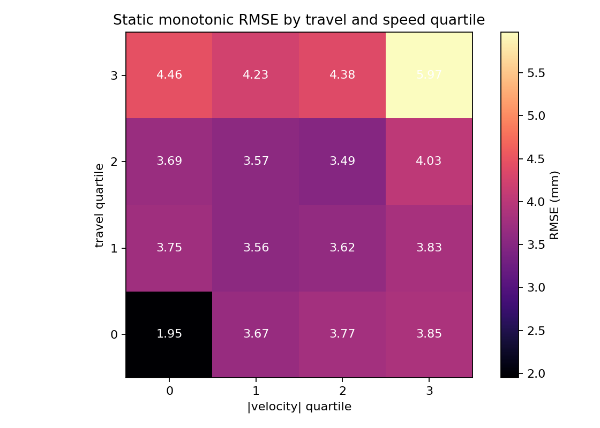
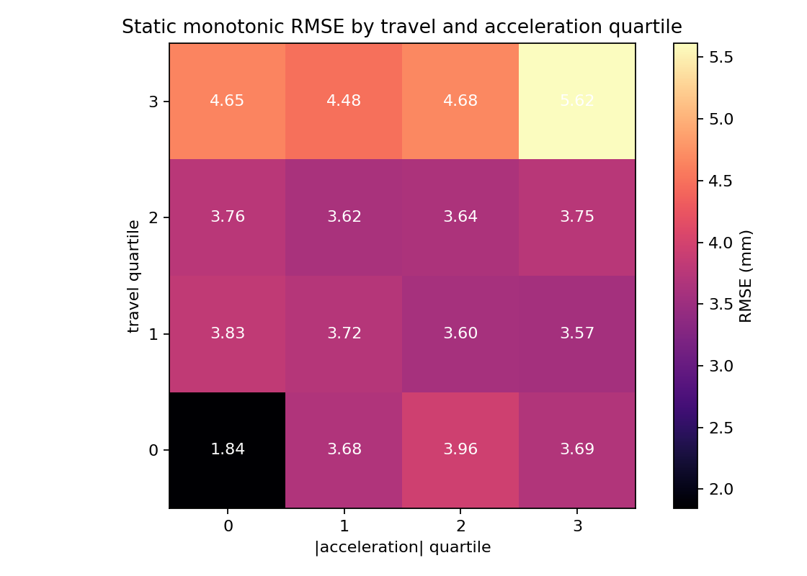
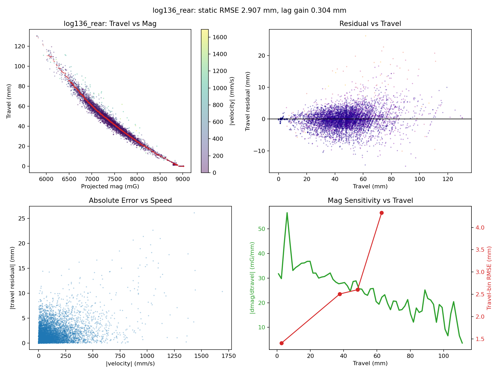
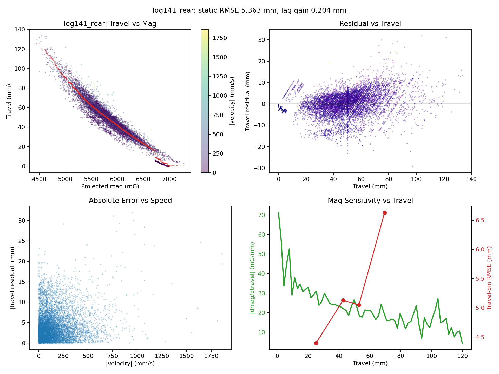

# Rear Mag Error Pattern Analysis

Logs used:

- `log136_rear`
- `log137_rear`
- `log140_rear`
- `log141_rear`
- `log142_rear`
- `log143_rear`
- `log144_rear`
- `log145_rear`

## Main Findings

- The strongest recurring pattern is **error growth at deep travel**. Across logs, the top travel quartile has the highest static monotonic RMSE.
- **Speed matters too**, but especially at deep travel. The aggregate travel/speed heatmap peaks in the highest-travel, highest-speed cell at `5.97 mm`.
- **Acceleration matters**, but a bit less cleanly. The aggregate travel/acceleration heatmap peaks in the highest-travel, highest-acceleration cell at `5.62 mm`.
- After controlling for travel and acceleration, the mean partial Spearman correlation between `|err|` and `|v|` is `0.129`.
- After controlling for travel and speed, the mean partial Spearman correlation between `|err|` and `|a|` is `0.106`.
- A simple **compression vs rebound split does not help**. Mean gain from direction-specific isotonic fits is `-0.247 mm`, which is slightly negative.
- A small **timing lag** is present but secondary. The best lag is almost always `-1` sample, with mean RMSE gain `0.199 mm`.
- Error tracks **low mag sensitivity** as well as speed. Mean Spearman correlations: `|err|` vs `|v|` = `0.294`, `|err|` vs `|a|` = `0.278`, `|err|` vs low sensitivity = `0.310`.
- Training a static oracle only on slower points does **not** materially improve all-point RMSE. Mean gain from slow-point-only training is `-0.060 mm`.

## Interpretation

- The data does not mainly look like a two-branch hysteresis problem. If it were, separate compression/rebound fits would help noticeably, but they do not.
- The data looks more like a **quasi-static monotonic map with a weak-sensitivity region near high travel**, where travel becomes hard to infer accurately from mag because `|dmag/dtravel|` gets small.
- High speed makes that weak-sensitivity region worse. Acceleration also tags the bad region, but its independent effect is smaller once travel and speed are accounted for.
- Time/drift effects exist in some logs but are not consistent enough to look like the primary global issue.

## What Probably Won't Help Much

- Training the same single static map only on slow or “clean” points.
- Splitting only by motion direction.

## What Might Help Next

- Improve the **mag projection / feature** so the high-travel region has more sensitivity.
- Allow a slightly richer static map than the current power-law model.
- Add a small dynamic correction term keyed off speed or a tiny lag compensation, since the lag signal is weak but consistent.

## Per-Log Summary

| Log | Static RMSE (mm) | Lag Gain | `rho(|err|,|v|)` | `rho(|err|,|a|)` | Partial `rho(|err|,|v|)` | Partial `rho(|err|,|a|)` |
|---|---:|---:|---:|---:|---:|---:|
| `log136_rear` | 2.907 | 0.304 | 0.460 | 0.428 | 0.205 | 0.133 |
| `log137_rear` | 3.191 | 0.264 | 0.328 | 0.301 | 0.158 | 0.114 |
| `log140_rear` | 3.337 | 0.223 | 0.464 | 0.445 | 0.159 | 0.132 |
| `log141_rear` | 5.363 | 0.204 | 0.172 | 0.173 | 0.064 | 0.083 |
| `log142_rear` | 3.093 | 0.132 | 0.157 | 0.139 | 0.092 | 0.063 |
| `log143_rear` | 4.585 | 0.149 | 0.148 | 0.162 | 0.086 | 0.112 |
| `log144_rear` | 3.383 | 0.188 | 0.490 | 0.473 | 0.189 | 0.157 |
| `log145_rear` | 4.674 | 0.133 | 0.136 | 0.107 | 0.081 | 0.054 |

Aggregate travel/speed heatmap:

Aggregate travel/acceleration heatmap:

Representative lowest static-RMSE log: `log136_rear`

Representative highest static-RMSE log: `log141_rear`

