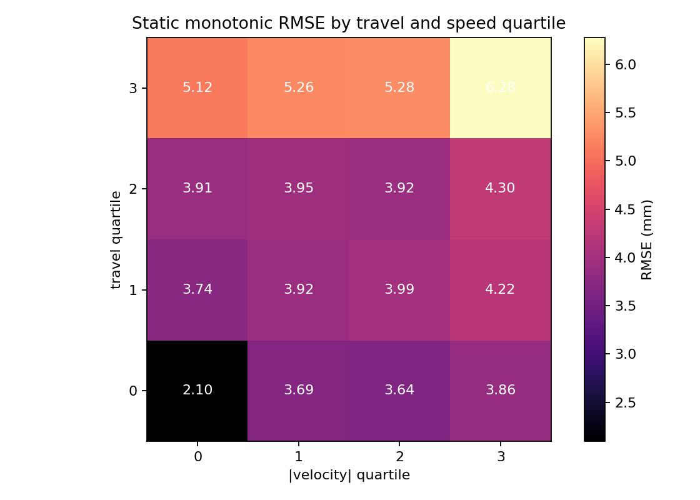
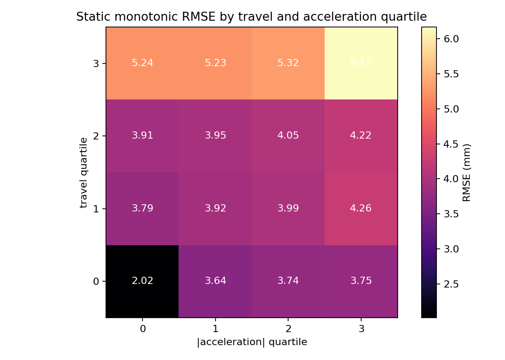
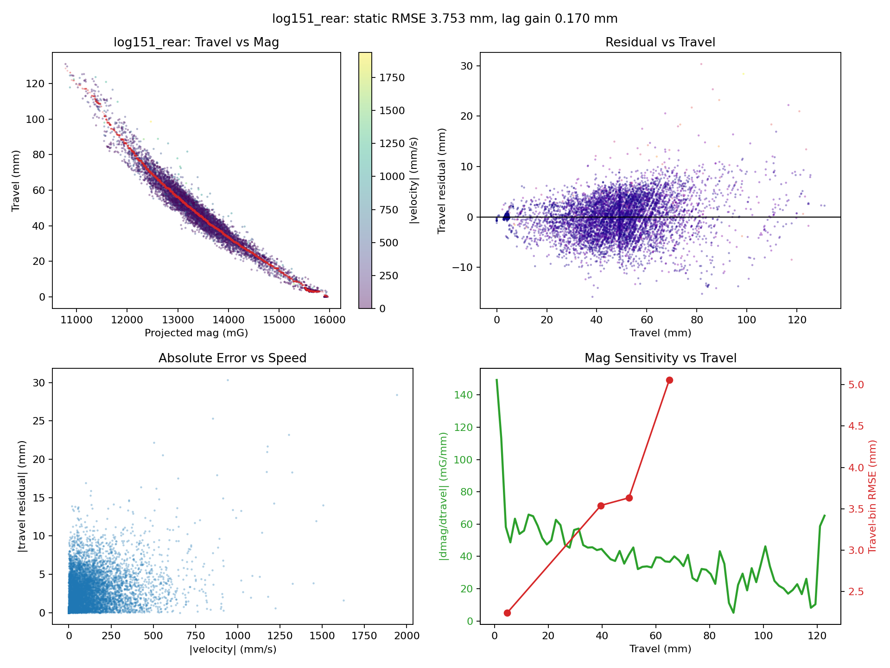
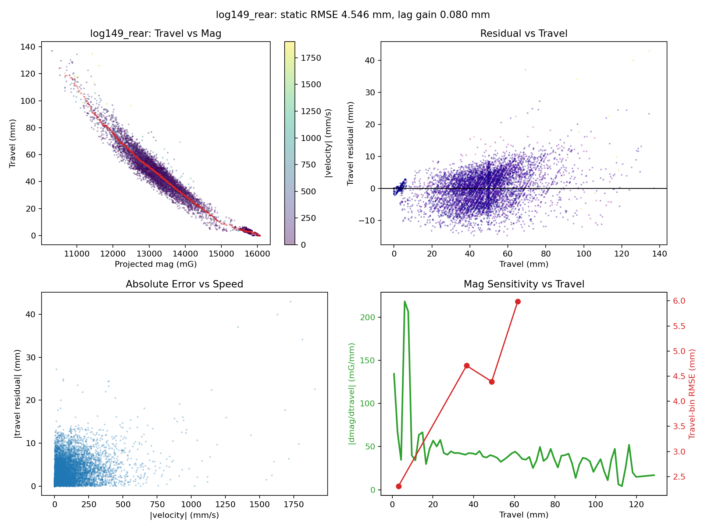

# Rear Mag Error Pattern Analysis

Logs used:

- `log149_rear`
- `log150_rear`
- `log151_rear`
- `log152_rear`
- `log153_rear`

## Main Findings

- The strongest recurring pattern is **error growth at deep travel**. Across logs, the top travel quartile has the highest static monotonic RMSE.
- **Speed matters too**, but especially at deep travel. The aggregate travel/speed heatmap peaks in the highest-travel, highest-speed cell at `6.28 mm`.
- **Acceleration matters**, but a bit less cleanly. The aggregate travel/acceleration heatmap peaks in the highest-travel, highest-acceleration cell at `6.17 mm`.
- After controlling for travel and acceleration, the mean partial Spearman correlation between `|err|` and `|v|` is `0.078`.
- After controlling for travel and speed, the mean partial Spearman correlation between `|err|` and `|a|` is `0.089`.
- A simple **compression vs rebound split does not help**. Mean gain from direction-specific isotonic fits is `-0.237 mm`, which is slightly negative.
- A small **timing lag** is present but secondary. The best lag is almost always `-1` sample, with mean RMSE gain `0.101 mm`.
- Error tracks **low mag sensitivity** as well as speed. Mean Spearman correlations: `|err|` vs `|v|` = `0.206`, `|err|` vs `|a|` = `0.209`, `|err|` vs low sensitivity = `0.241`.
- Training a static oracle only on slower points does **not** materially improve all-point RMSE. Mean gain from slow-point-only training is `-0.061 mm`.

## Interpretation

- The data does not mainly look like a two-branch hysteresis problem. If it were, separate compression/rebound fits would help noticeably, but they do not.
- The data looks more like a **quasi-static monotonic map with a weak-sensitivity region near high travel**, where travel becomes hard to infer accurately from mag because `|dmag/dtravel|` gets small.
- High speed makes that weak-sensitivity region worse. Acceleration also tags the bad region, but its independent effect is smaller once travel and speed are accounted for.
- Time/drift effects exist in some logs but are not consistent enough to look like the primary global issue.

## What Probably Won't Help Much

- Training the same single static map only on slow or “clean” points.
- Splitting only by motion direction.

## What Might Help Next

- Improve the **mag projection / feature** so the high-travel region has more sensitivity.
- Allow a slightly richer static map than the current power-law model.
- Add a small dynamic correction term keyed off speed or a tiny lag compensation, since the lag signal is weak but consistent.

## Per-Log Summary

| Log | Static RMSE (mm) | Lag Gain | `rho(|err|,|v|)` | `rho(|err|,|a|)` | Partial `rho(|err|,|v|)` | Partial `rho(|err|,|a|)` |
|---|---:|---:|---:|---:|---:|---:|
| `log149_rear` | 4.546 | 0.080 | 0.435 | 0.439 | 0.150 | 0.162 |
| `log150_rear` | 4.356 | 0.078 | 0.069 | 0.077 | 0.031 | 0.045 |
| `log151_rear` | 3.753 | 0.170 | 0.350 | 0.337 | 0.142 | 0.126 |
| `log152_rear` | 4.359 | 0.057 | 0.060 | 0.093 | 0.014 | 0.064 |
| `log153_rear` | 4.206 | 0.118 | 0.118 | 0.098 | 0.056 | 0.048 |

Aggregate travel/speed heatmap:

Aggregate travel/acceleration heatmap:

Representative lowest static-RMSE log: `log151_rear`

Representative highest static-RMSE log: `log149_rear`

