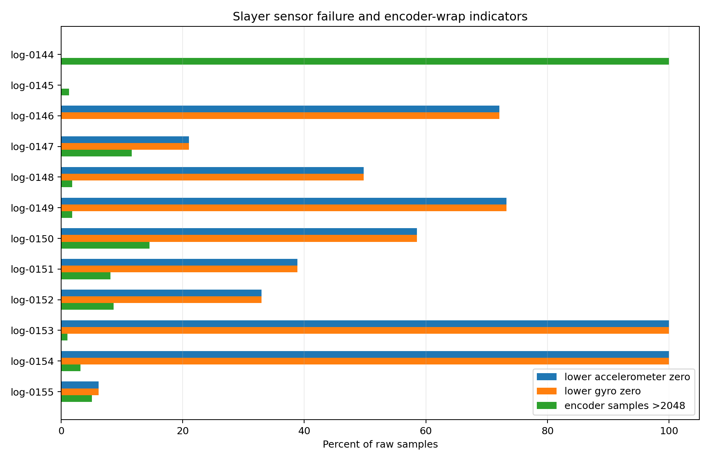
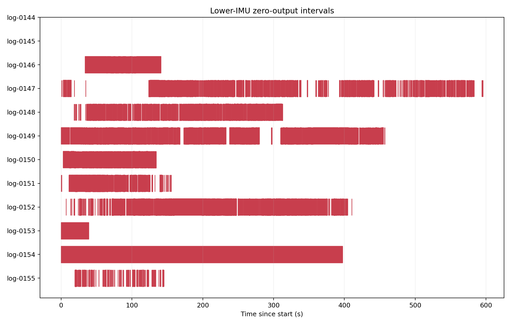
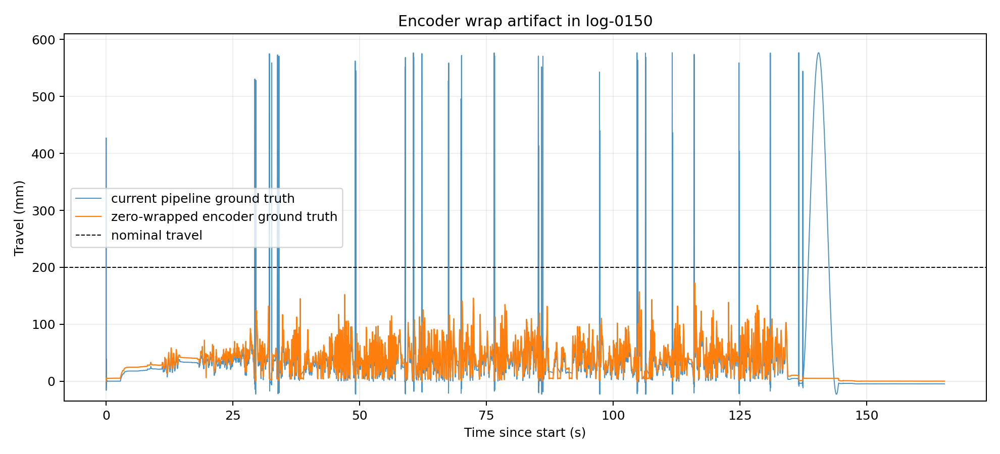
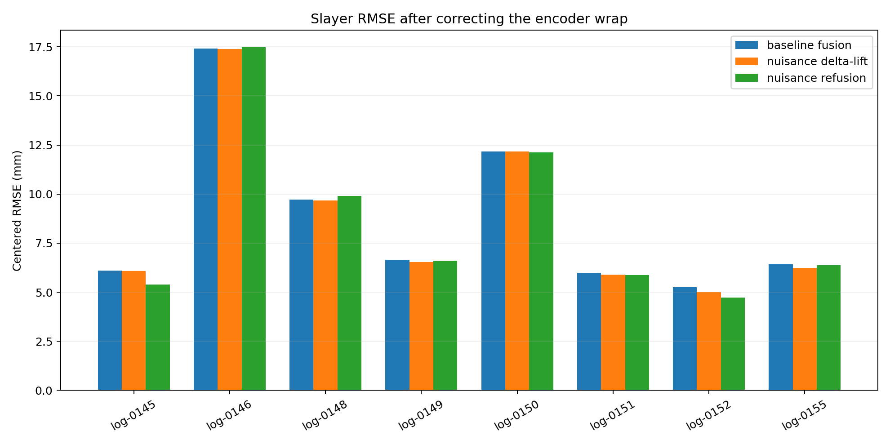
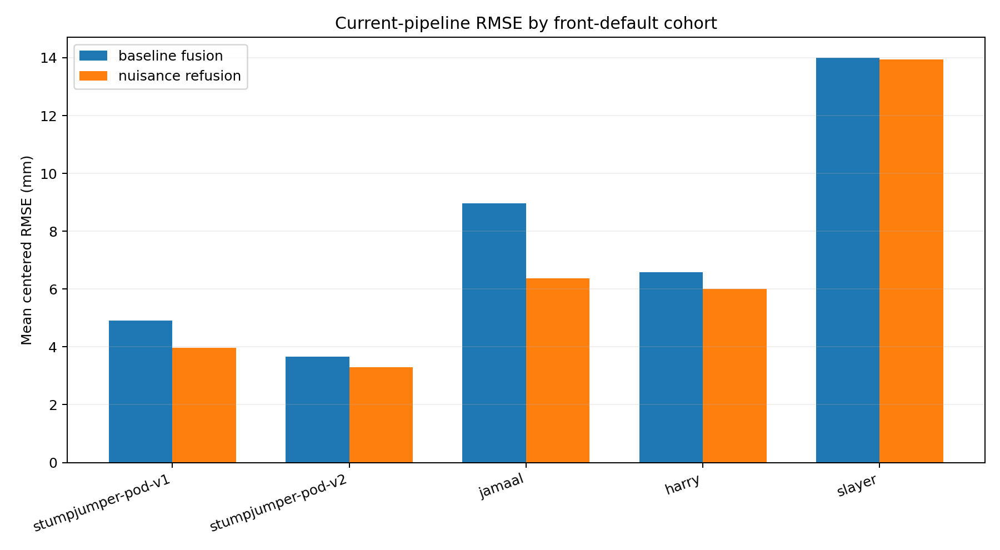

# Slayer log and pipeline diagnosis

## Executive summary

The Slayer import contains three separate problems that compound in the headline RMSE:

1. **One file is not a ride.** `log-0144` is a 34.8 s stationary recording: gyro dynamic RMS is 0.14 deg/s, the encoder spans only 0.09°, and its accelerometer pose never changes enough to calibrate the two IMUs.
2. **The lower IMU is failing.** Its accelerometer and gyro emit simultaneous all-zero records in 10 of 12 logs. The loss is complete in `log-0153` and `log-0154`, and ranges from 21% to 73% in six other riding logs. The same signals are never zero in the 31 pod-v2 `front-default` logs from the established bikes. This is a real Slayer data-acquisition failure, not normal sparse sampling.
3. **The encoder crosses its numeric wrap point.** Riding samples lie on both sides of count 0/4095. The current loader converts counts to unsigned radians and low-pass filters across that discontinuity, so a small physical motion near top-out becomes a nearly full-turn numerical jump. The resulting nominal 200 mm fork “ground truth” reaches approximately 577 mm. The angle corruption mask catches exact 0 and 4095 values but not their near-rail neighbors, and interpolation across the wrap can make the transient wider.[^1]

These problems explain nearly all of the apparent cohort gap. On the eight logs that finish the pipeline, mean centered baseline RMSE is 14.01 mm with the current ground truth. Re-expressing encoder counts continuously around zero reduces it to 8.72 mm. Restricting that evaluation to intervals at least 0.20 s away from lower-IMU zero output reduces it again to 5.17 mm. That is close to Stumpjumper pod-v1 (4.92 mm), better than Harry (6.59 mm) and Jamaal (8.96 mm), although still above Stumpjumper pod-v2 (3.65 mm).[^2]

The nuisance correction is not materially reversing on clean Slayer data. With the current broken ground truth, second-pass nuisance fusion regresses on 4/8 logs, but every regression is tiny (+0.003 to +0.099 mm centered RMSE). After encoder unwrapping it regresses on 2/8, by only +0.052 and +0.164 mm. On lower-IMU-healthy intervals it improves all 8 logs, reducing mean centered RMSE from 5.17 to 4.86 mm.[^2] The observed “correction makes RMSE worse” behavior is therefore primarily an evaluation artifact plus lower-IMU contamination.

There is also a distinct **absolute-reference calibration failure**. It drives mean uncentered Slayer RMSE to 42.10 mm versus 7.35–15.17 mm in the established cohorts. Encoder unwrapping does not fix that offset. In `log-0148`, `log-0150`, and `log-0155`, the acceleration-derived reference is wrong by approximately +62, +104, and +58 mm respectively against the unwrapped encoder, and the global adjustment shifts the magnetic prediction by +85, +129, and +94 mm. Several reference estimates are based on only 2–15 selected samples.[^3]

## Scope and method

The audit covers all 12 registry entries in set `slayer`, `log-0144` through `log-0155`. All are 200 Hz, have no sequence-number gaps, and use the same pod-v2/Slayer/Boxxer profile.[^4] Pipeline failures were reproduced with the current worktree. The eight successful caches were compared with the four main `front-default` cohorts: 11 Stumpjumper pod-v2 logs, 7 Stumpjumper pod-v1 logs, 6 Jamaal logs, and 14 Harry logs.

The main RMSE comparison is centered RMSE because it isolates waveform/shape quality from the separate absolute-reference problem. Uncentered RMSE is reported where it reveals calibration bias. The wrap-corrected diagnostic maps 12-bit encoder counts into the signed interval around zero before applying the current 20 Hz filter, 2:1 decimation, Slayer geometry, and per-log 99.5th-percentile top reference. It changes only the evaluation target; the cached predictions remain untouched. The script also reproduces the current angle path to sub-nanometre numerical agreement before changing the wrapping rule.[^5]

The “lower-IMU-healthy” comparison excludes zero-output samples plus a 0.20 s halo on either side, allowing for filter ringing. It is a localization diagnostic, not a claim that trimming the final metric alone repairs a solver that has already processed bad acceleration.

Because exact count 0/4095 samples could be either legitimate top-out values or rail faults, a sensitivity run also interpolated those samples after—not before—wrap normalization. Its mean centered baseline RMSE is 9.23 mm overall and 5.30 mm on lower-IMU-healthy intervals, versus 8.72 and 5.17 mm when the exact rail values are retained. The diagnosis is therefore not sensitive to that ambiguity.[^2]

## Per-log triage

| Log | Ride? | Lower IMU zero | Primary sensor zero | Encoder wrap-side samples | Pipeline | Disposition |
| --- | --- | ---: | ---: | ---: | --- | --- |
| `log-0144` | No | 0.0% | 0.0% | 100.0% (stationary at count 4071/4072) | Fails pose calibration | Exclude: no riding data |
| `log-0145` | Yes | **0.0%** | 0.0% | 1.27% | Success | Best clean log; retain after wrap fix |
| `log-0146` | Yes | **72.1%** | 0.54% | 0.08% | Success | Quarantine; salvage healthy intervals only |
| `log-0147` | Yes | **21.0%** | 0.38% | 11.63% | Fails reference/solver | Recoverable code path, but still dropout-affected |
| `log-0148` | Yes | **49.8%** | 0.71% | 1.84% | Success | Quarantine; reference badly biased |
| `log-0149` | Yes | **73.3%** | 1.16% | 1.80% | Success | Quarantine; salvage healthy intervals only |
| `log-0150` | Yes | **58.5%** | 1.18% | 14.54% | Success | Quarantine; worst reference bias |
| `log-0151` | Yes | **38.9%** | 0.72% | 8.09% | Success | Quarantine; salvage healthy intervals only |
| `log-0152` | Yes | **33.0%** | 0.54% | 8.63% | Success | Quarantine; salvage healthy intervals only |
| `log-0153` | Yes, short | **100.0%** | 0.0% | 1.01% | Fails IMU pairing | Exclude: lower IMU absent |
| `log-0154` | Yes | **100.0%** | 0.00% | 3.19% | Fails IMU pairing | Exclude: lower IMU absent |
| `log-0155` | Yes | **6.2%** | 0.04% | 5.04% | Success | Salvageable with dropout mask; reference must be rejected |

“Primary sensor zero” in the table is the upper/primary accelerometer rate; gyro1 and primary-magnet zero rates are similar. In affected logs, 85–100% of primary zero records occur inside a lower-IMU dropout, but only 0–2% of lower-IMU zero records coincide with primary loss. This indicates a system-level disturbance with much more severe loss on the lower sensor link. The lower accelerometer and gyro zero masks are identical in every log except `log-0147`, where they differ by 0.0008 percentage point.[^1]

The LIS3MDL columns are all zero in every Slayer log, but this is not a Slayer-specific failure: they are also all zero in all 31 established pod-v2 front logs. That sensor is loaded but is not consumed by the current front estimator. The MMC5603 primary magnetometer remains dynamic in every ride and shows no persistent stuck-value pattern.

The failures are often long contiguous outages rather than isolated samples. The longest lower-IMU outages are 34.5 s in `log-0146`, 29.0 s in `log-0149`, 38.1 s in `log-0152`, and the entire recordings in `log-0153`/`0154`.[^1]

## Why four pipelines fail

### `log-0144`: no pose diversity, then an unguarded empty calibration set

The pipeline initially finds 139 stationary accelerometer-pair chunks, but all represent essentially one gravity direction. The collinearity filter therefore keeps 0/139. `RotationFromPairs` receives empty arrays and the Kabsch SVD fails with `LinAlgError: 1-dimensional array given`.[^6]

This is correctly understood as an unsuitable input log, not a numerical solver defect. The code should nevertheless stop earlier with a clear “insufficient non-collinear poses / no ride” validation message.

### `log-0153` and `log-0154`: lower IMU absent, then an unguarded empty pair-stat calculation

Both lower-IMU channels are exactly zero for 100% of each recording. No chunk can satisfy the expected 1 g magnitude test. `FilterChunkPairs` builds an empty list, but calls `get_pair_stats` unconditionally; that function assumes a four-dimensional pair array and takes a mean along axis 2. The actual empty array is one-dimensional, producing `AxisError: axis 2 is out of bounds`.[^6]

The exception is secondary. These logs cannot run the current dual-accelerometer estimator and should fail ingestion or preflight health checks before filtering.

### `log-0147`: empty reference selection becomes NaN, then surfaces as a misleading solver error

This log passes accelerometer alignment despite 21% lower-IMU loss. The absolute-reference detector finds two candidate bump chunks, but their magnetic values are approximately 1296–1316 mG. The selection window is forced to `mag_baseline + 1000` through `mag_baseline + 3000`, or approximately 2406–4406 mG, so it contains zero points. The code checks the case of no candidate chunks but does not check the case of candidate chunks with no points inside the final window. Median-of-empty therefore stores `[NaN, NaN]` as the reference.[^7]

That NaN propagates through the adjusted magnetic prediction. The travel solver eventually raises `ValueError: Initial guess is outside of provided bounds`; the real cause is a non-finite initial prediction, not an ordinary 0–170 mm bound violation. The partial cache confirms that `28_get_mag_travel_ref_point.npz` contains `[NaN, NaN]`.

## Encoder wrap and RMSE inflation

The established cohorts keep encoder counts well away from the 12-bit boundary. Pod-v2 Stumpjumper logs occupy roughly 2920–3420 counts; Jamaal and Harry occupy roughly 965–1560. Slayer instead sits around zero and crosses between low counts and values near 4095.[^1]

The current loader first maps every count into `[0, 2π)`, interpolates exact rails in that unsigned space, and only then low-pass filters. `AngleToTravel` applies the geometry directly, without circular unwrapping.[^8] A transition such as `2 → 4094` is therefore treated as almost a full revolution rather than `2 → -2`. This yields short false spikes and longer filtered plateaus between 300 and 577 mm.

| Slayer evaluation target | Baseline fusion mean centered RMSE | Median | Nuisance refusion mean | Refusion regressions |
| --- | ---: | ---: | ---: | ---: |
| Current pipeline ground truth | 14.01 mm | 14.20 mm | 13.94 mm | 4/8 |
| Encoder zero unwrapped | 8.72 mm | 6.54 mm | 8.56 mm | 2/8 |
| Unwrapped + lower-IMU-healthy intervals | **5.17 mm** | **5.02 mm** | **4.86 mm** | **0/8** |

The current ground truth has 0.02–3.16% of samples above the nominal 200 mm travel limit across the successful logs, and 99th percentiles as high as 531 mm. The wrap-aware ground truth has no samples over 200 mm and per-log 99th percentiles of 84–120 mm.[^1]

The wrap explains the broad inflation in centered RMSE. Lower-IMU dropout explains most of the remaining outliers:

| Log | Current centered baseline | Wrap-corrected | Wrap-corrected, healthy lower IMU | Healthy refusion |
| --- | ---: | ---: | ---: | ---: |
| `log-0145` | 12.13 | 6.10 | 6.10 | 5.40 |
| `log-0146` | 17.70 | 17.42 | **5.37** | 5.33 |
| `log-0148` | 16.54 | 9.73 | **7.19** | 7.10 |
| `log-0149` | 8.73 | 6.66 | **5.13** | 4.39 |
| `log-0150` | 15.04 | 12.18 | **4.79** | 4.72 |
| `log-0151` | 13.35 | 5.99 | **3.71** | 3.47 |
| `log-0152` | 11.33 | 5.26 | **4.14** | 3.58 |
| `log-0155` | 17.23 | 6.41 | **4.92** | 4.86 |

The lower-IMU zeros are particularly damaging because the loader interprets them as physical zero acceleration. After rotating sensor 2, the relative acceleration becomes approximately sensor 1—including gravity—throughout an outage. Low/high-pass filtering smears every outage boundary, while the displacement and travel solver treat the resulting waveform as motion. This also contaminates the bump detector used for absolute calibration.

## Cohort comparison

| Cohort | Logs | Baseline centered RMSE | Nuisance refusion | Change | Refusion regressions |
| --- | ---: | ---: | ---: | ---: | ---: |
| Stumpjumper pod-v2 | 11 | **3.65** | **3.30** | −0.36 | 0/11 |
| Stumpjumper pod-v1 | 7 | 4.92 | 3.96 | −0.96 | 0/7 |
| Harry | 14 | 6.59 | 6.00 | −0.59 | 1/14 |
| Jamaal | 6 | 8.96 | 6.37 | −2.58 | 0/6 |
| Slayer, current ground truth | 8 | **14.01** | **13.94** | −0.06 | 4/8 |
| Slayer, corrected/healthy diagnostic | 8 | **5.17** | **4.86** | −0.31 | 0/8 |

The corrected/healthy Slayer result does not prove that a rerun with validity-aware acceleration will land at exactly 4.86 mm. It does show that the high cohort-wide error is localized to invalid evaluation geometry and lower-IMU outages rather than an intrinsically poor magnetic geometry on the new bike.[^2]

## Why uncentered RMSE remains high

The wrap fix mainly corrects waveform shape. It lowers mean centered baseline RMSE by 5.29 mm but lowers uncentered baseline RMSE only from 42.10 to 35.90 mm. The dominant remaining term is a global reference shift.[^2]

The raw magnetic model has 27.53 mm mean uncentered RMSE against the wrap-corrected target. The acceleration-derived reference adjustment worsens that to 36.04 mm before fusion. Three logs dominate:

| Log | Selected reference samples | Reference error vs unwrapped encoder | Applied magnetic-model offset |
| --- | ---: | ---: | ---: |
| `log-0145` | 102 | −2.5 mm | +16.2 mm |
| `log-0146` | 6 | +2.1 mm | +26.8 mm |
| `log-0148` | 9 | **+62.4 mm** | **+85.2 mm** |
| `log-0149` | 8 | −6.9 mm | +32.2 mm |
| `log-0150` | 15 | **+104.2 mm** | **+128.8 mm** |
| `log-0151` | 44 | +5.4 mm | +36.8 mm |
| `log-0152` | 19 | −11.3 mm | +18.9 mm |
| `log-0155` | 2 | **+57.8 mm** | **+94.0 mm** |

Slayer's median magnetic offset is 34.5 mm, versus 7.9–18.4 mm for the four established cohorts. The median reference-point error is +9.3 mm for Slayer but −7.4 to −19.1 mm in the established cohorts. `log-0155` shows that dropout is not the only trigger: only 6.2% of its lower-IMU samples are zero, but its reference is based on two points. The current procedure has no minimum selected-sample count, uncertainty estimate, or two-sided sanity check for a large positive global shift.[^3]

## Nuisance correction behavior

The correction is nearly neutral under the broken metric because it is small relative to the two large upstream errors. The delta-lift changes the baseline signal by only 0.82–2.12 mm RMS on these logs, while the current centered ground-truth error is 8.7–17.2 mm and absolute offsets can exceed 100 mm.[^3]

Slayer also lies outside the original correction development distribution in several ways:

- Only 19% of Slayer nuisance states are updated on average, versus 45–83% in the established cohorts. The 1500 mG gate is active over less of these recordings.
- Estimated nuisance-vector RMS is moderately higher: 253 mG median versus approximately 173–199 mG in the established pod-v2/Boxxer cohorts.
- The encoder-free XYZ paths are unstable in `log-0148`, `log-0150`, and `log-0155`; their median 0–30 mm path slopes are about 217, 3143, and 770 mG/mm, compared with cohort medians of 7–23 mG/mm. Those values indicate a poorly conditioned bootstrap, not exceptional physical fork sensitivity.[^3]

These are valid reasons to add correction-health gates before promoting Slayer to a production cohort. They are not, however, the main explanation for the measured regressions. The actual centered second-fusion regressions under the current target are only +0.003 (`0149`), +0.028 (`0155`), +0.048 (`0146`), and +0.099 mm (`0148`). After wrap correction only `0146` (+0.052) and `0148` (+0.164) regress; on healthy lower-IMU intervals every log improves. Delta-lift is even more stable: it improves all eight after unwrapping and has one negligible +0.010 mm regression on healthy intervals.[^2]

## Recommended actions

### 1. Fix data acceptance before tuning the estimator

- Mark `log-0144` non-riding and exclude it from processing/statistics.
- Mark `log-0153` and `log-0154` unusable for the dual-IMU front pipeline.
- Keep `log-0145` as the clean reference recording.
- Treat `log-0155` as salvageable after validity masking.
- Quarantine `log-0146` through `log-0152` (except `0145`) until the lower-sensor link is understood; use only explicitly valid segments for experiments.
- Investigate the lower-IMU power/connector/bus or logger validity path. The exact equality of accel2/gyro2 zero masks and long outages points to loss of the lower IMU as a unit, not independent sensor noise.

### 2. Make the angle path circular before any interpolation or filtering

- Add a profile-level encoder wrap center/offset and map counts into a continuous signed interval around the working range before low-pass filtering.
- Do not classify raw 0 and 4095 as automatically corrupt when the configured operating range crosses that boundary. Detect impossible jumps or stuck rails only after wrap normalization.
- After a clean calibration ride, set a fixed Slayer `top_zeroangle` rather than estimating it independently from every ride. The current per-log estimates span about 0.000–0.047 rad, so rides that never fully top out can acquire different absolute zeros.

### 3. Propagate sensor validity instead of zero-filling

- Create explicit validity masks during conversion/ingestion for each IMU.
- Prevent filters from bridging zero-output gaps as if they were physical samples; split into valid contiguous segments or use gap-aware filtering.
- Require a minimum amount of valid, non-collinear dual-accelerometer data before estimating the rotation.
- Exclude any calibration bump whose still/bump window intersects a lower-IMU invalid region plus filter halo.

### 4. Harden failure paths and absolute calibration

- In `FilterChunkPairs`, handle an empty result before computing pair statistics.
- In `RotationFromPairs`, require a minimum number and angular spread of pose pairs, with a diagnostic error naming the failed requirement.
- In the absolute-reference path, handle both “no candidate chunks” and “candidate chunks but zero selected points.” Never allow NaN to enter the travel solver.
- Require a minimum selected-point count and report confidence/dispersion. A threshold around 20–30 points would have rejected the worst Slayer references, though it should be validated against older short logs.
- Add a two-sided plausibility fallback. The present negative-prediction fallback catches excessive negative travel but not the +60 to +130 mm positive shifts seen here.

### 5. Re-evaluate nuisance correction only after those fixes

Rerun the eight riding logs with wrap-aware encoder handling, validity-aware lower-IMU segments, and guarded reference calibration. Compare `travel/fusion1`, delta-lift, corrected magnetic observation, and second fusion on identical masks. Add correction-health flags for low update coverage, insufficient XYZ bins, extreme 0–30 mm path slope, and large final iteration change. There is no evidence yet that Slayer needs retuned nuisance weights; tuning against the current corrupted target would likely overfit the failures.

## Reproducibility and data files

- [Analysis script](../../tools/front/archive/slayer/analyze_slayer.py)
- [Per-log sensor audit](sensor_audit.csv)
- [Per-log RMSE table](rmse_per_log.csv)
- [Current-ground-truth cohort summary](cohort_summary_current_ground_truth.csv)
- [Wrap-corrected Slayer summary](slayer_corrected_ground_truth_summary.csv)
- [Nuisance and reference diagnostics](nuisance_diagnostics.csv)
- [Versioned partial stats experiment](../../experiments/stats/20260913T022632Z-slayer-diagnostic/report.txt)

## Sources

[^1]: Slayer converted sensor logs, summarized in [sensor_audit.csv](sensor_audit.csv), and the reproducible calculations in [analyze_slayer.py](../../tools/front/archive/slayer/analyze_slayer.py). Raw/converted files are registered under `logs/converted/log-0144.csv` through `log-0155.csv`.
[^2]: Per-log and cohort error calculations in [rmse_per_log.csv](rmse_per_log.csv), [cohort_summary_current_ground_truth.csv](cohort_summary_current_ground_truth.csv), and [slayer_corrected_ground_truth_summary.csv](slayer_corrected_ground_truth_summary.csv). The current pipeline's standard eight-log output is independently captured in the [saved stats experiment](../../experiments/stats/20260913T022632Z-slayer-diagnostic/report.txt).
[^3]: Cached nuisance summaries, XYZ paths, model offsets, and reproduced reference selection in [nuisance_diagnostics.csv](nuisance_diagnostics.csv).
[^4]: Slayer log profiles and import validation in [the log registry](../../logs/registry.toml); cohort definitions are the registry sets `stumpjumper-front-pod-v1`, `stumpjumper-front-pod-v2`, `jamaal`, `harry`, and `front-default`.
[^5]: Wrap-aware diagnostic implementation and current-path reproduction in [analyze_slayer.py](../../tools/front/archive/slayer/analyze_slayer.py). The current angle loader/filter configuration is in [backend/pipeline.py](../../backend/pipeline.py) and [backend/classes/sensor_loader.py](../../backend/classes/sensor_loader.py).
[^6]: Empty-pair assumptions in [backend/accel_rotation.py](../../backend/accel_rotation.py), especially `FilterChunkPairs.get_pair_stats`, `FilterColinearPairs`, and `RotationFromPairs`.
[^7]: Reference selection and missing empty-window guard in [backend/fusion.py](../../backend/fusion.py); the downstream solver setup is in [backend/travel_solver_core.py](../../backend/travel_solver_core.py).
[^8]: Unsigned count conversion in [backend/classes/sensor_loader.py](../../backend/classes/sensor_loader.py) and non-circular geometry conversion in [backend/angle.py](../../backend/angle.py).
